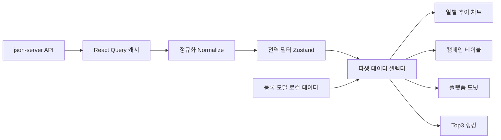

# 요구사항 기반 설계서

## 1. 설계 목표
- 글로벌 필터를 기준으로 모든 위젯이 일관되게 동기화되는 데이터 흐름 구축
- 데이터 예외(0 나눗셈, null, 형식 불일치)로 인한 UI 오류 방지
- 기능 추가(선택 과제, 지표 확장)에 유연한 컴포넌트 구조 확보

## 1.1 원문 제약 반영
- 데이터 원본(`db.json`)은 수정하지 않고 API로만 조회
- import 방식으로 데이터 직접 로딩 금지
- 신규 등록/상태 변경은 브라우저 메모리 기준으로 반영(새로고침 시 초기화 허용)
- 파생 지표는 필터링된 `daily_stats` 집계값으로 실시간 계산

## 1.2 요구사항 분류
### 기능 요구사항
- 필수
  - 3.1 글로벌 필터: 기간/상태/매체 + 초기화 + AND 조합 + 전 위젯 동기화
  - 3.2 일별 추이 차트: X축 날짜, Y축 수치, 범례/툴팁, 메트릭 토글(최소 1개 유지)
  - 3.3 캠페인 테이블: 정렬/검색(테이블 전용)/페이지네이션(10)/일괄 상태 변경
  - 3.4 캠페인 등록 모달: 필드 검증, active 고정, ID 자동 생성, 즉시 반영
- 선택
  - 4.1 플랫폼 도넛: 메트릭 토글, 플랫폼 비중, 필터 양방향 연동
  - 4.2 Top3 랭킹: 메트릭 토글, ROAS/CTR/CPC 정렬 규칙 반영

### 비기능 요구사항
- 데이터 안정성: null/0 분모/포맷 불일치 정규화 및 안전 계산
- 데이터 일관성: 단일 데이터 파이프라인(조회 -> 정규화 -> 병합 -> 필터 -> 집계)
- 성능: 파생 계산 메모이제이션 및 불필요한 리렌더 최소화
- 확장성: 위젯 추가(도넛/Top3) 시 공통 selector 재사용 가능 구조
- 접근성/UX: 로딩/에러/빈 상태 대응, 반응형 고려

## 2. 시스템 구성


## 3. 데이터 모델
### 3.1 엔티티
- `Campaign`: 캠페인 메타 정보
- `DailyStat`: 캠페인별 일자 성과

### 3.2 정규화 규칙
- 숫자 필드: `NaN`, 음수 등 비정상 값은 0으로 보정
- `conversionsValue: null`은 0으로 변환
- 날짜 필드: `YYYY-MM-DD` strict 파싱 실패 시 제외 또는 fallback

## 4. 상태 설계
## 4.1 서버 상태 (React Query)
- `useCampaignsQuery()`
- `useDailyStatsQuery()`

## 4.2 클라이언트 상태 (Zustand)
- 글로벌 필터: `dateRange`, `statuses`, `platforms`
  - `dateRange` 초기값: 당월 1일~말일
  - `statuses` 초기값: 전체(`active`, `paused`, `ended`)
  - `platforms` 초기값: 전체(`Google`, `Meta`, `Naver`)
- 차트 토글: `trendMetrics`, `platformMetric`, `rankingMetric`
  - `trendMetrics` 초기값: `impressions + clicks` 활성
  - `platformMetric` 초기값: `cost`
  - `rankingMetric` 초기값: `roas`
- 테이블 상태: `search`, `sort`, `page`, `selectedIds`
  - `page` 초기값: 1
  - `pageSize`: 10 (고정)
- 모달 상태: `isCreateModalOpen`
- 로컬 추가 데이터: `localCampaigns`, `localDailyStats`

## 5. 요구사항 매핑
### 5.1 글로벌 필터
- 모든 위젯은 `filteredCampaignIds`를 공통 입력으로 사용
- AND 조건 결합
- 초기화 버튼으로 초기 상태 복원
- 기간/상태/매체 변경 시 차트와 테이블이 동일 시점에 동기화
- 상태/매체는 다중 선택 지원

### 5.2 일별 추이 차트
- `groupBy(date)`로 일별 합산
- 메트릭 토글 최소 1개 강제
- Tooltip/Legend 필수
- X축 날짜, Y축 수치 고정
- 기본 활성 메트릭: 노출수 + 클릭수
- 호버 시 날짜별 수치 표시

### 5.3 캠페인 테이블
- 컬럼: 캠페인명, 상태, 매체, 집행기간, 총 집행금액, CTR, CPC, ROAS
- 캠페인별 집계 + 파생지표 계산 결과를 row로 생성
- 정렬 대상: 집행기간, 총 집행금액, CTR, CPC, ROAS (오름/내림차순)
- 검색은 테이블 데이터에만 반영
- 검색 결과 건수 / 전체 건수 표기
- 페이지당 10건
- 체크박스 선택 + 일괄 상태 변경
- 일괄 상태 변경은 드롭다운으로 진행중/일시중지/종료 선택

### 5.4 캠페인 등록 모달
- 검증 실패 시 필드 하단 메시지
- 성공 시 로컬 상태 반영으로 즉시 UI 동기화
- `status=active`, `id=uuid` 자동 설정
- 입력 필드:
  - 캠페인명: 2~100자
  - 광고 매체: Google/Meta/Naver 중 1개
  - 예산: 정수, 100~1,000,000,000
  - 집행 금액: 정수, 0~1,000,000,000, 예산 초과 불가
  - 시작일: 필수
  - 종료일: 시작일 이후
- 신규 캠페인에 `daily_stats`가 없으면 지표는 0 또는 `-` 표기 허용

### 5.5 선택 과제
- 도넛 클릭 시 플랫폼 필터 토글 연동
- Top3는 지표별 정렬 방향 다르게 적용
- 도넛 메트릭 토글: 비용/노출/클릭/전환 (기본값: 비용)
- Top3 메트릭 토글: ROAS/CTR/CPC (기본값: ROAS)
- 정렬 규칙: ROAS/CTR 내림차순, CPC 오름차순

## 6. 파생 지표 계산
```ts
CTR = impressions > 0 ? (clicks / impressions) * 100 : 0
CPC = clicks > 0 ? cost / clicks : 0
ROAS = cost > 0 ? (conversionsValue / cost) * 100 : 0
```

- 공통 예외 처리:
  - Division by zero 방어
  - `conversionsValue: null` -> `0`
  - 날짜 포맷(`YYYY-MM-DD`, `YYYY/MM/DD`) 정규화
  - 비정상 enum/status/platform 값 매핑

## 7. 성능/품질 전략
- 파생 계산 `useMemo` 및 selector 기반 최적화
- 컴포넌트 책임 분리로 불필요한 리렌더 방지
- 예외 케이스 단위 테스트 우선 작성

## 8. 테스트 전략
- 유틸 단위 테스트: metrics, filter, sort
- 컴포넌트 테스트: 필터-차트/테이블 동기화, 모달 등록 즉시 반영
- 회귀 테스트: 토글 최소 1개 유지, 일괄 상태 변경
